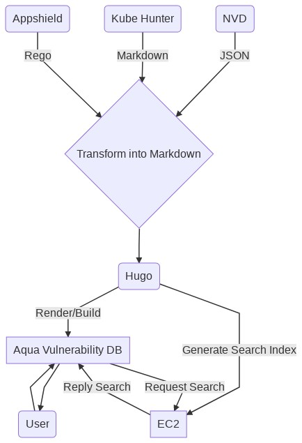

# AVD: Aqua Vulnerability DB

### Description
AVD or Aqua Vulnerability DB is a datalake of all vulnerability and security related information gathered and compiled
by Aqua Security into an easy and friendly to use interface.

### Quick Demo


### Technical Overview

<!--- https://mermaid-js.github.io/mermaid-live-editor/#/edit/eyJjb2RlIjoiZ3JhcGggVERcblx0QShOVkQpIC0tPnxKU09OfCBCe1RyYW5zZm9ybSBpbnRvIE1hcmtkb3dufVxuXHRFKEt1YmUgSHVudGVyKSAtLT58TWFya2Rvd258IEJ7VHJhbnNmb3JtIGludG8gTWFya2Rvd259XG5cdEYoQXBwc2hpZWxkKSAtLT58UmVnb3wgQntUcmFuc2Zvcm0gaW50byBNYXJrZG93bn1cbiAgICBCIC0tPiBDKEh1Z28pXG5cdEMgLS0-fFJlbmRlci9CdWlsZHwgRFtBcXVhIFZ1bG5lcmFiaWxpdHkgREJdXG5cdEMgLS0-fEdlbmVyYXRlIFNlYXJjaCBJbmRleHwgR1tFQzJdXG5cdFUoVXNlcikgLS0-fEVudGVyIFF1ZXJ5fCBEXG5cdEQgLS0-fEdldCBSZXNwb25zZXwgVShVc2VyKVxuXHREIC0tPnxSZXF1ZXN0IFNlYXJjaHwgR1xuXHRHIC0tPnxSZXBseSBTZWFyY2h8IERcblx0XHRcdFx0XHQiLCJtZXJtYWlkIjp7InRoZW1lIjoiZGVmYXVsdCJ9LCJ1cGRhdGVFZGl0b3IiOmZhbHNlfQ --->

### Component breakdown 
#### Sources
AVD uses a variety of sources to generate the content. NVD JSON feed, Aqua recommended Kube Hunter advisories and Appshield Rego policies.

#### Hugo
Hugo is a static site generator. It compiles Markdown into pleasing websites.

#### EC2
AVD uses [MeiliSearch](https://github.com/meilisearch/MeiliSearch) as its search engine. MeiliSearch runs on top of an `t2.medium` EC2 instance in `eu-west-2`.

#### Generator
Generator is the knife that sharpens all sources to transform them into Markdown pages. It can be found [here](https://github.com/aquasecurity/aqua-vulnerability-db-hugo/blob/master/main.go). 

#### GitHub Pages
AVD is hosted through the magic of GitHub Pages. The generated pages are part of this repo. The generated content lives in `docs`.

#### GitHub Actions
AVD is built every 24h using GitHub Actions. The changes are then committed and pushed to the repo.

### Requirements
1. [Hugo](https://github.com/gohugoio/hugo) (version v0.73.0 or newer)
2. [MeiliSearch](https://github.com/meilisearch/MeiliSearch) for running search
3. Go


### Building
Note: Set `baseURL="/"` [here](https://github.com/aquasecurity/aqua-vulnerability-db-hugo/blob/master/config.toml#L1-L4) before proceeding.

#### tl;dr    
`make md-generate hugo-generate nginx-restart`    
then navigate to `http://localhost:9011` to view the pages.

#### To just build markdown pages:
`make md-generate` markdowns will be generated in `content/`

#### To just build the hugo site:
`make hugo-generate` site will be generated in `docs/`

#### To have a functional search:
1. Run MeiliSearch locally      
`docker run -p 7700:7700 -v $(pwd)/data.ms:/data.ms getmeili/meilisearch`

2. Setup search index    
`curl -X POST 'http://127.0.0.1:7700/indexes' --data '{ "uid" : "content", "primaryKey": "title"}'`  
   
3. Add generated index.json to build search indexes    
`curl -X POST 'http://127.0.0.1:7700/indexes/content/documents' --data @docs/index.json`  
 
4. To monitor index build progress:    
`curl -X GET 'http://localhost:7700/indexes/content/updates'`

5. Set the host and apiKey in `static/js/fastsearch.js` for using MeiliSearch:   
``` 
meilisearch = new MeiliSearch({
         host: 'http://localhost',
         apiKey: "<public meilisearch if you set a master key only, otherwise remove>",
 })
```


